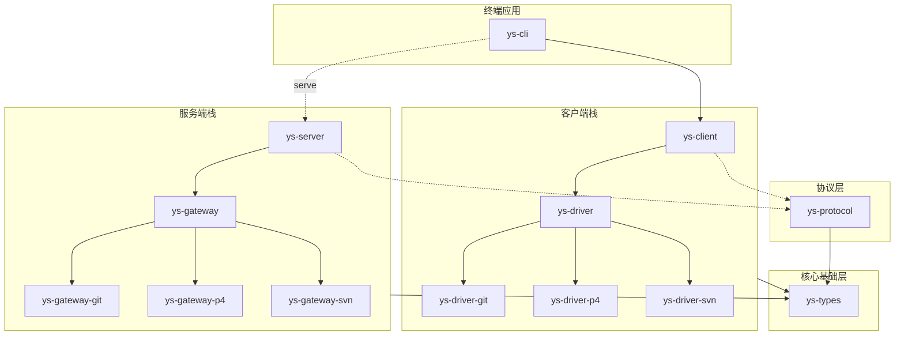

# 源神

源神 (ys) 是一个高性能、多协议兼容的版本管理系统，旨在提供对 Git、SVN 和 Perforce (P4) 等协议的原生支持与无缝转换。

## 项目架构

本项目采用模块化的分层架构，各组件职责分明：

### 核心基础层
- **[ys-types](projects/ys-types)**: 最底层模块，定义了系统通用的核心数据结构（对象模型、快照等）以及中心化的错误处理机制机制。
- **[ys-protocol](projects/ys-protocol)**: 原生二进制通讯协议层，负责高效的数据序列化与网络传输。

### 服务端 (Server Stack)
- **[ys-gateway](projects/ys-gateway)**: 服务端兼容协议定义。
- **具体实现**:
  - **[ys-gateway-git](projects/ys-gateway-git)**: Git 协议网关实现。
  - **[ys-gateway-p4](projects/ys-gateway-p4)**: P4 协议网关实现。
  - **[ys-gateway-svn](projects/ys-gateway-svn)**: SVN 协议网关实现。
- **[ys-server](projects/ys-server)**: 服务端核心集成，整合各协议网关提供统一的版本管理服务。

### 客户端 (Client Stack)
- **[ys-driver](projects/ys-driver)**: 客户端驱动协议定义。
- **具体实现**:
  - **[ys-driver-git](projects/ys-driver-git)**: Git 驱动实现。
  - **[ys-driver-p4](projects/ys-driver-p4)**: P4 驱动实现。
  - **[ys-driver-svn](projects/ys-driver-svn)**: SVN 驱动实现。
- **[ys-client](projects/ys-client)**: 客户端核心集成，封装驱动层逻辑。

### 终端应用
- **[ys-cli](projects/ys-cli)**: **本项目唯一的二进制程序**。
  - 作为通用客户端运行，执行各种版本控制命令。
  - 支持 `serve` 模式，可直接作为服务端启动。

---

## 开发规范 (Emoji Comment)

我们在提交信息中使用以下 Emoji 来标识变更类型：

| Emoji  | Meaning                      |  
|--------|------------------------------|  
| 🎂     | Project initialized!         |  
| 🎉     | Release new version          |  
| 🧪🔮   | Experimental code            |   
| 🔧🐛🐞 | Bug fix                      |  
| 🔒     | Security fix                 |  
| 🐣🐤🐥 | Add feature                  |  
| 📝🎀   | Documentation                |  
| 🚀     | Performance improve!         |  
| 🚧     | Work in progress             |  
| 🚨     | Test coverage improve!       |  
| 🚥     | CI improve!                  |  
| 🔥🧨   | Remove code or files         |
| 🧹     | Code refactor                |
| 📈     | Add analytics or branch code |
| 🤖     | Automation fix               |
| 📦     | Update dependencies          |
